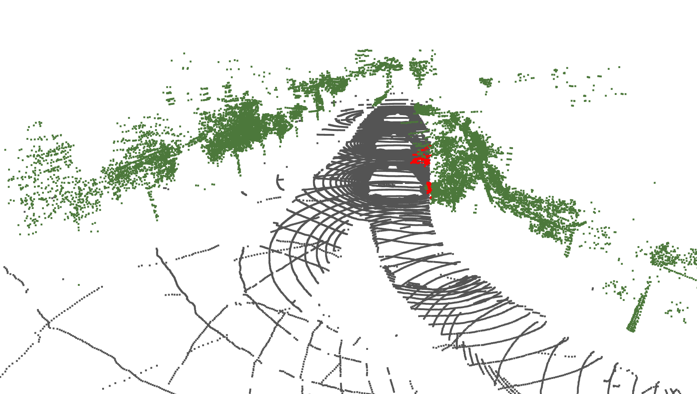

# 🌳 3D Clearance Control: Automatic Roadside Vegetation Maintenance 🌳

<div align="center">
  
</div>

## 📝 Abstract
Overgrown roadside vegetation poses a danger to road users by obstructing the visibility of the road and potentially obscuring signs or other traffic participants.
Thus, regulations clearly define the height above the road that must not be obscured. As manually identifying such incidents is time-consuming, we propose 3D Clearance Control: a pipeline that automatically detects vegetation in need of trimming. Our system is based on LiDAR point clouds, which give access to accurate position and height information. It comprises four main steps: the semantic segmentation of the point cloud, the aggregation of scans within a scene, the estimation of road boundaries, and the creation of the volume representing the clearance gauge.
We developed a modular process to perform a comprehensive evaluation combining different segmentation models and road boundary approximation methods. We measure the accuracy and computing times on three widely used street-level datasets: SemanticKITTI, NuScenes, and PandaSet. 
We achieved an mIoU of 67.6 on our annotated test scenes and a speed increase of 52.7\% compared to previous systems.

In this [video](https://cloud.scadsai.uni-leipzig.de/index.php/s/sm4NNYjL4wyigNL), we give a brief overview and a visualization of the single steps of our pipeline.

## ⚙️ Getting Started
### Download the Datasets
- [SemanticKITTI](http://www.semantic-kitti.org/dataset.html#download)
- [NuScenes](https://www.nuscenes.org/nuscenes#download) with lidarseg (mini-version is sufficient for tests)
- [PandaSet](https://www.kaggle.com/datasets/usharengaraju/pandaset-dataset?resource=download)

### Prepare Environments

- install [conda](https://conda.io/projects/conda/en/latest/user-guide/install/index.html)
- run script```python setup.py``` (creates two environments: one for RandLANet and one for SphereFormer)

#### For SphereFormer:
- ```conda activate env_sphere```
- install the [pandaset devkit](https://github.com/scaleapi/pandaset-devkit?tab=readme-ov-file#setup)
- install SparseTransformer: ```python ./SphereFormer/third_party/SparseTransformer/setup.py install```

#### For RandLANet:
- ```conda activate env_randlanet```
- install the [pandaset devkit](https://github.com/scaleapi/pandaset-devkit?tab=readme-ov-file#setup)
- extend open3dML library with the [files in the /open3dML/to_include_in Open3D-ML directory](https://github.com/isl-org/Open3D-ML/blob/main/docs/howtos.md#adding-a-new-dataset)

### Download weights
- download the [trained SphereFormer models for SemanticKITTI and NuScenes](https://github.com/dvlab-research/SphereFormer/tree/master?tab=readme-ov-file#pre-trained-models) from the SphereFormer repository 
 and put them in the /SphereFormer/weights folder
- download our trained [SphereFormer model for Pandaset](https://drive.google.com/file/d/1HobLtvtEdFEVIGl0BDC-lmGj9eQ5tsOO/view?usp=drive_link) and put it into the same folder

- download the trained [RandLA-Net model for SemanticKITTI](https://github.com/isl-org/Open3D-ML?tab=readme-ov-file#semantic-segmentation-1) from the Open3d-ML repository and put it in the opn3dML/weights_randlanet_semantickitti folder
- download the trained [RandLA-Net model for Pandaset](https://drive.google.com/file/d/1HobLtvtEdFEVIGl0BDC-lmGj9eQ5tsOO/view?usp=drive_link) and put it in the opn3dML/weights_randlanet_pandaset folder
- download our trained [RandLA-Net model for NuScenes](https://drive.google.com/file/d/1x0CAKt-amxfaYwYFYUGjKDU2g06Pq5TH/view?usp=drive_link) and put it in the opn3dML/weights_randlanet_nuscenes folder


## 🚀 Execute the Code
You have to specify the **dataset** (semantickitti, nuscenes, pandaset) and the **path** to the data. <br />
With **-s** you can specify which scene you want to analyze and with **--start, --stop, and --step** you can choose which scans will be concatenated. <br />
**-a** gives you the option to change the algorithm from the default mesh version to contours
and with **-m** you can choose the segmentation model (sphere or randlanet)

#### Examples:
- SemanticKITTI :```python main.py -d semantickitti -p /data/path/SemanticKITTI/dataset/ -s 09```
- NuScenes:  ```python main.py -d nuscenes -p /data/path/nuscenes_mini -s 8```
- PandaSet: ```python main.py -d pandaset -p /data/path/pandaset -s 002```

Once the system is started, the individual steps of the system are visualized. 
The arrow keys can be used to switch to the next or previous view. 
Finally, points of vegetation that protrude beyond the road are marked in red. These parts must be trimmed.

## 📎 Related Repositories
This repository contains functions and altered code from the following repositories:
- [SphereFormer](https://github.com/dvlab-research/SphereFormer/) (Apache 2.0 License)
- [Semantic KITTI API](https://github.com/PRBonn/semantic-kitti-api) (MIT License)

We also call functions from the Devkits developed for 
- [PandaSet](https://github.com/scaleapi/pandaset-devkit/) (Apache 2.0 License) and
- [NuScenes](https://github.com/nutonomy/nuscenes-devkit/) (Apache 2.0 License).

The licenses for those repositories can be found in the folder "/licenses".
